# Laporan Hasil User Acceptance Testing (UAT)

## Aplikasi "Pizza Snack Play"

---

| Dokumen                          | Detail                                                                  |
| :------------------------------- | :---------------------------------------------------------------------- |
| **Aplikasi**                     | Pizza Snack Play                                                        |
| **Versi Aplikasi**               | v1.7 (Fitur Jadwal Per Kelas, Kunci & Publikasi, Klaim Jadwal, PWA)     |
| **Tanggal Pengujian**            | 19 September 2026                                                       |
| **Waktu Pengujian**              | 04:05 WIB                                                               |
| **Status Keseluruhan**           | **100% PASSED (21 dari 21 Skenario Lolos)**                             |
| **Lingkungan Pengujian**         | Local Dev (`http://localhost:5173`) — Vite + Hono + Cloudflare D1 Local |
| **Browser Engine**               | Google Chrome Headless via Puppeteer Core (`scripts/run-uat.mjs`)       |
| **Folder Bukti Tangkapan Layar** | [`outputs/screenshots/`](../outputs/screenshots/)                       |

---

## 1. Ringkasan Eksekutif

Pengujian Penerimaan Pengguna (_User Acceptance Testing_ / UAT) dilakukan untuk memvalidasi fungsionalitas menyeluruh aplikasi **Pizza Snack Play** dari perspektif seluruh pemangku kepentingan (_roles_): **Admin Sekolah**, **Koordinator Kelas (Korlas)**, **Orang Tua Murid**, dan **Orang Tua dengan Banyak Anak (Multi-Siswa)**.

Pengujian mencakup seluruh alur bisnis utama:

1. **Autentikasi & Otorisasi**: Proteksi login, pembedaan hak akses (_Role-Based Access Control_), penolakan aksi tidak sah.
2. **Dashboard & Statistik**: Ringkasan jumlah akun, menu snack aktif, jadwal sekolah, dan hari libur nasional/sekolah.
3. **Tampilan Jadwal**: Tampilan jadwal harian (_Hari Ini_), Sepekan (_Senin–Jumat_), dan bulanan (_Kalender_).
4. **Manajemen Jadwal**: Alur status jadwal tiga tahap (_Draft_ $\rightarrow$ _Locked_ $\rightarrow$ _Published_), duplikasi jadwal antar ahad (_Copy Week_), dan penetapan hari libur.
5. **Katalog & Kategori Menu**: CRUD menu snack (makanan utama + buah pendamping) serta _tagging_ kategori berwarna.
6. **Pencarian Riwayat Menu**: Pencarian kata kunci lintas bulan dengan penyorotan teks (_highlighting_) pada nama menu maupun komponennya.
7. **Manajemen Akun Orang Tua**: Pengelolaan data orang tua, relasi anak multi-kelas, dan pengangkatan wali murid menjadi Korlas.
8. **Pilih / Klaim Jadwal (F9)**: Alur orang tua memilih tanggal piket snack yang belum berpetugas (_siapa cepat dia dapat_).
9. **Class Switcher (Multi-Anak)**: Kemampuan beralih konteks kelas bagi orang tua yang memiliki anak di kelas berbeda.
10. **Pengalaman Pengguna Responsif & PWA (F10)**: Tampilan pada layar smartphone serta banner instalasi _Progressive Web App_.

---

## 2. Akun & Aktor Pengujian

| Username | Role     | Nama Akun    | Hubungan / Kelas                                    | Keterangan Akses                                                                                                                                         |
| :------- | :------- | :----------- | :-------------------------------------------------- | :------------------------------------------------------------------------------------------------------------------------------------------------------- |
| `admin`  | `admin`  | Bu Guru Sari | Admin Sekolah                                       | Akses menyeluruh (CRUD jadwal semua kelas, katalog, akun orang tua, dashboard statistik, penetapan hari libur).                                          |
| `budi`   | `korlas` | Pak Budi     | Ayah dari Bagas Budi (Kelas 1)                      | Koordinator Kelas 1. Akses terbatas pada jadwal kelas 1 dan katalog menu sekolah. Tidak dapat mengakses dashboard sekolah atau mengelola akun orang tua. |
| `sari`   | `parent` | Ibu Sari     | Ibu dari Aisyah Sari (Kelas 1)                      | Orang tua murid tunggal. Hak akses baca jadwal kelas 1, akses fitur klaim tanggal piket (_Pilih Jadwal_), dan ubah password profil.                      |
| `dewi`   | `parent` | Ibu Dewi     | Ibu dari Citra Dewi (Kelas 2) & Raka Dewi (Kelas 3) | Orang tua murid dengan multi-anak. Memiliki _Class Switcher_ di header untuk berganti tampilan jadwal antar kelas anak.                                  |

---

## 3. Matriks Hasil Pengujian UAT (21 Skenario)

| ID Skenario | Modul / Fitur   | Deskripsi Pengujian                                               |   Role   |   Status   | Bukti Screenshot                                                                                              |
| :---------: | :-------------- | :---------------------------------------------------------------- | :------: | :--------: | :------------------------------------------------------------------------------------------------------------ |
| **UAT-01**  | Autentikasi     | Halaman Login Awal (_form bersih, logo, branding_)                |  Guest   | **PASSED** | [`uat-01-halaman-login.png`](../outputs/screenshots/uat-01-halaman-login.png)                                 |
| **UAT-02**  | Autentikasi     | Validasi Login Gagal (_kredensial salah menampilkan pesan error_) |  Guest   | **PASSED** | [`uat-02-login-validasi-gagal.png`](../outputs/screenshots/uat-02-login-validasi-gagal.png)                   |
| **UAT-03**  | Autentikasi     | Login Sukses Admin & Pengalihan Halaman                           |  Admin   | **PASSED** | [`uat-03-login-sukses-admin.png`](../outputs/screenshots/uat-03-login-sukses-admin.png)                       |
| **UAT-04**  | Dashboard       | Dashboard Admin & Ringkasan Metrik Statistik                      |  Admin   | **PASSED** | [`uat-04-dashboard-admin.png`](../outputs/screenshots/uat-04-dashboard-admin.png)                             |
| **UAT-05**  | Jadwal Harian   | Tampilan Menu Snack Hari Ini & ahad Berjalan                      |  Admin   | **PASSED** | [`uat-05-jadwal-hari-ini.png`](../outputs/screenshots/uat-05-jadwal-hari-ini.png)                             |
| **UAT-06**  | Jadwal Sepekan  | Tampilan Menu Senin s/d Jumat & Navigasi ahad                     |  Admin   | **PASSED** | [`uat-06-jadwal-ahad-ini.png`](../outputs/screenshots/uat-06-jadwal-ahad-ini.png)                             |
| **UAT-07**  | Jadwal Bulanan  | Kalender Rekap Bulanan (September 2026)                           |  Admin   | **PASSED** | [`uat-07-jadwal-bulanan.png`](../outputs/screenshots/uat-07-jadwal-bulanan.png)                               |
| **UAT-08**  | Kelola Jadwal   | Tabel Jadwal Bulanan dengan Status _Draft / Locked / Published_   |  Admin   | **PASSED** | [`uat-08-kelola-jadwal-admin.png`](../outputs/screenshots/uat-08-kelola-jadwal-admin.png)                     |
| **UAT-09**  | Kelola Jadwal   | Modal Dialog Salin Jadwal Antar ahad (_Copy Week_)                |  Admin   | **PASSED** | [`uat-09-modal-salin-ahad.png`](../outputs/screenshots/uat-09-modal-salin-ahad.png)                           |
| **UAT-10**  | Kelola Jadwal   | Modal Dialog Tambah Hari Libur Sekolah                            |  Admin   | **PASSED** | [`uat-10-modal-hari-libur.png`](../outputs/screenshots/uat-10-modal-hari-libur.png)                           |
| **UAT-11**  | Katalog Menu    | Tampilan Katalog Menu Snack & Komponen (Utama + Buah)             |  Admin   | **PASSED** | [`uat-11-katalog-menu.png`](../outputs/screenshots/uat-11-katalog-menu.png)                                   |
| **UAT-12**  | Katalog Menu    | Modal Dialog Formulir Tambah Menu Snack Baru                      |  Admin   | **PASSED** | [`uat-12-modal-tambah-menu.png`](../outputs/screenshots/uat-12-modal-tambah-menu.png)                         |
| **UAT-13**  | Kategori Menu   | Manajemen Kategori Menu & Palet Warna Badge                       |  Admin   | **PASSED** | [`uat-13-kategori-menu.png`](../outputs/screenshots/uat-13-kategori-menu.png)                                 |
| **UAT-14**  | Pencarian       | Pencarian Riwayat Menu & Buah dengan Kata Kunci _"jeruk"_         |  Admin   | **PASSED** | [`uat-14-pencarian-menu-jeruk.png`](../outputs/screenshots/uat-14-pencarian-menu-jeruk.png)                   |
| **UAT-15**  | Akun Orang Tua  | Daftar Akun Orang Tua, Siswa Terkait, & Badge Korlas              |  Admin   | **PASSED** | [`uat-15-kelola-akun-orang-tua.png`](../outputs/screenshots/uat-15-kelola-akun-orang-tua.png)                 |
| **UAT-16**  | Akun Orang Tua  | Modal Dialog Tambah Akun Orang Tua & Multi-Anak                   |  Admin   | **PASSED** | [`uat-16-modal-tambah-orang-tua.png`](../outputs/screenshots/uat-16-modal-tambah-orang-tua.png)               |
| **UAT-17**  | Pilih Jadwal    | Login Orang Tua (`sari`) & Akses Klaim Tanggal Piket (F9)         |  Parent  | **PASSED** | [`uat-17-pilih-jadwal-orang-tua.png`](../outputs/screenshots/uat-17-pilih-jadwal-orang-tua.png)               |
| **UAT-18**  | Multi-Anak      | Login Orang Tua Multi-Anak (`dewi`) & _Class Switcher_ Header     |  Parent  | **PASSED** | [`uat-18-orang-tua-multi-anak-switcher.png`](../outputs/screenshots/uat-18-orang-tua-multi-anak-switcher.png) |
| **UAT-19**  | Profil Akun     | Halaman Profil Pengguna Orang Tua & Form Ganti Password           |  Parent  | **PASSED** | [`uat-19-profil-orang-tua.png`](../outputs/screenshots/uat-19-profil-orang-tua.png)                           |
| **UAT-20**  | Wewenang Korlas | Login Korlas (`budi`) & Pembatasan Menu Khusus Kelas 1            | Korlas 1 | **PASSED** | [`uat-20-tampilan-korlas-kelas-1.png`](../outputs/screenshots/uat-20-tampilan-korlas-kelas-1.png)             |
| **UAT-21**  | Responsivitas   | Tampilan Layar Smartphone (iPhone 12/13/14) & Prompt PWA          |  Mobile  | **PASSED** | [`uat-21-responsive-mobile-view.png`](../outputs/screenshots/uat-21-responsive-mobile-view.png)               |

---

## 4. Rincian Pelaksanaan UAT per Skenario

### UAT-01: Halaman Login Awal

- **Tujuan**: Memastikan tampilan antarmuka formulir login bersih, logo termuat, dan tidak ada sisa sesi sebelumnya.
- **Hasil**: Form login tampil di tengah layar dengan latar ornamen warna tema (_brand, accent, highlight_), input username dan password responsif.
- **Screenshot**:
  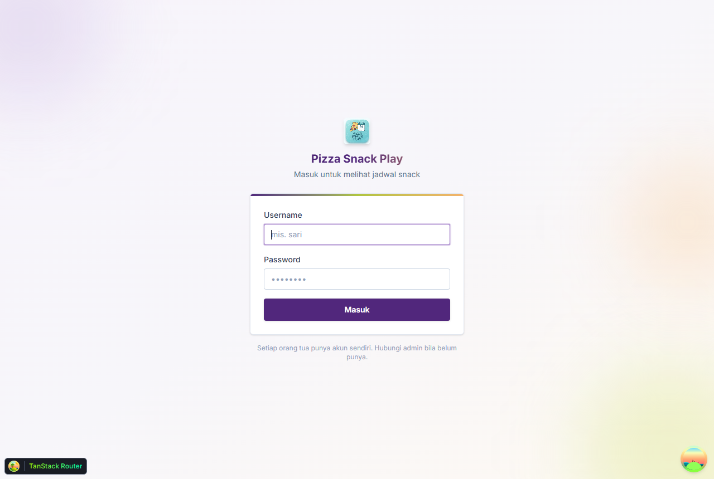

---

### UAT-02: Validasi Login Gagal

- **Tujuan**: Memastikan sistem menolak autentikasi dengan kredensial salah dan memberikan umpan balik yang informatif.
- **Tindakan**: Memasukkan username `admin` dengan password salah `password_salah_123`.
- **Hasil**: Muncul pesan peringatan berwarna merah (_"Username atau password salah"_), pengguna tetap berada di halaman login tanpa kebocoran sesi.
- **Screenshot**:
  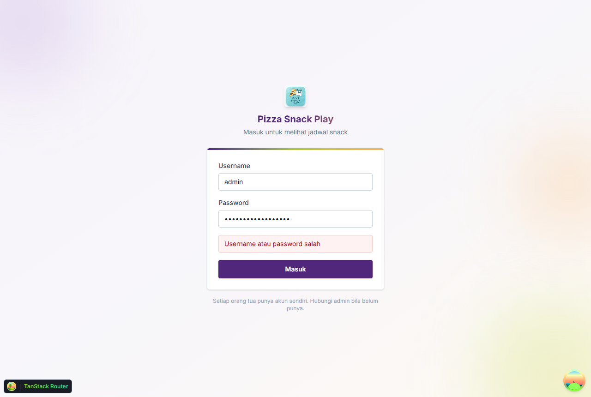

---

### UAT-03: Login Sukses Akun Admin

- **Tujuan**: Memverifikasi proses login berhasil dan pengguna dialihkan ke halaman utama.
- **Tindakan**: Memasukkan username `admin` dan password valid `snack123`.
- **Hasil**: Token JWT tersimpan di _local storage_, pengguna otomatis diarahkan ke rute `/hari-ini` dengan profil `Bu Guru Sari · Admin`.
- **Screenshot**:
  

---

### UAT-04: Dashboard Admin & Ringkasan Statistik

- **Tujuan**: Menampilkan ringkasan metrik sekolah yang hanya berhak dilihat oleh Admin.
- **Hasil**: Menampilkan 4 kartu statistik utama: **37 Akun orang tua** (37 aktif), **42 Menu** (42 aktif), **260 Entri jadwal**, dan **1 Hari libur tercatat**. Ringkasan jadwal hari ini dan pekan berjalan tampil akurat.
- **Screenshot**:
  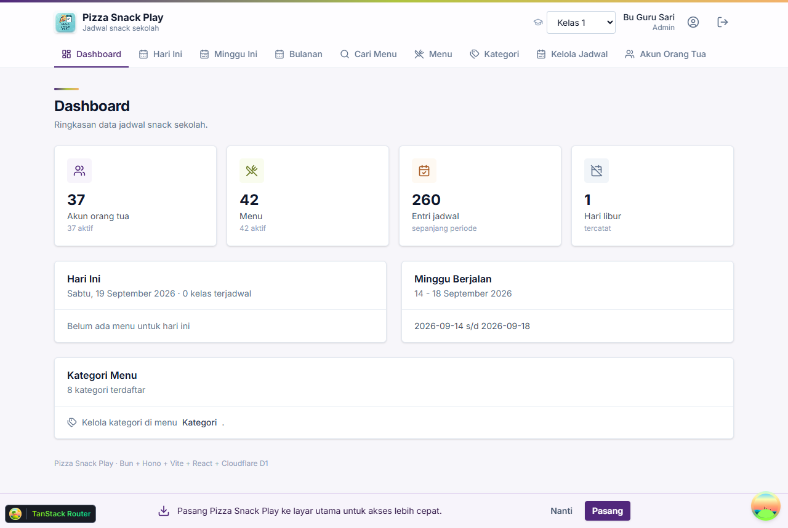

---

### UAT-05: Jadwal Hari Ini

- **Tujuan**: Memverifikasi penyajian menu snack untuk hari ini beserta jadwal ahad berjalan.
- **Hasil**: Kartu jadwal hari ini tampil lengkap dengan label tanggal, status libur/sekolah, dan ringkasan menu hari Senin–Jumat pada ahad berjalan.
- **Screenshot**:
  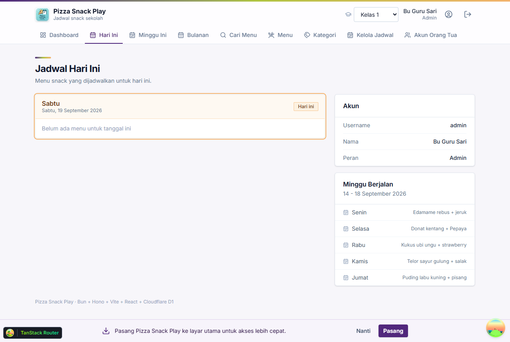

---

### UAT-06: Jadwal Sepekan (Senin s/d Jumat)

- **Tujuan**: Memverifikasi tampilan grid jadwal Senin hingga Jumat per kelas.
- **Hasil**: Grid 5 hari tampil terstruktur. Terdapat tombol navigasi _"Sebelumnya"_ dan _"Berikutnya"_ untuk berpindah pekan, serta tombol _"Kembali ke pekan ini"_.
- **Screenshot**:
  

---

### UAT-07: Jadwal Kalender Bulanan

- **Tujuan**: Memverifikasi kalender rekap bulanan untuk September 2026.
- **Hasil**: Menampilkan seluruh 5 ahad dalam bulan September 2026. Setiap hari menampilkan menu utama, buah pendamping, petugas piket, dan lencana status (_Dipublikasi_).
- **Screenshot**:
  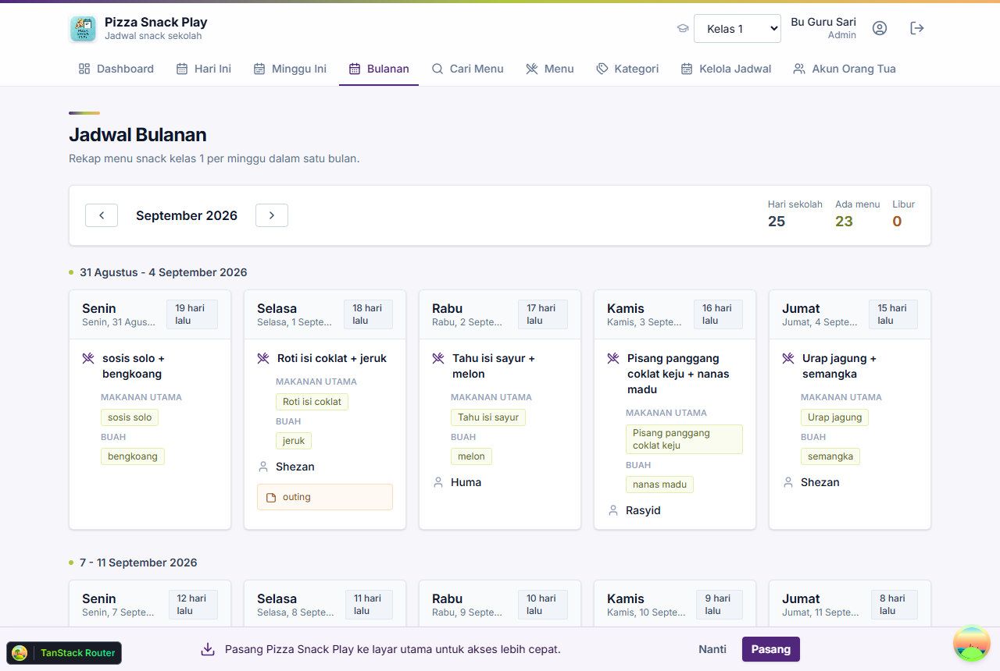

---

### UAT-08: Kelola Jadwal (Admin & Status Draft / Locked / Published)

- **Tujuan**: Memverifikasi pengelolaan jadwal bulanan dan siklus tiga status (_draft_ $\rightarrow$ _locked_ $\rightarrow$ _published_).
- **Hasil**: Form tabel per tanggal menampilkan dropdown pilihan menu, input petugas piket, input orang tua, catatan, tombol kunci/buka kunci baris, dan tombol aksi massal (_Kunci bulan, Publikasi, Salin ahad, + Hari libur_).
- **Screenshot**:
  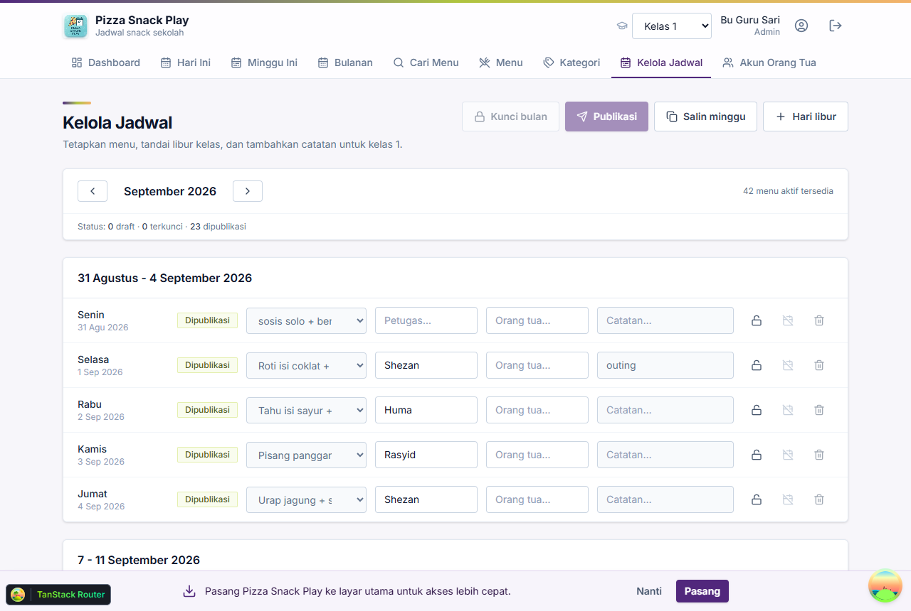

---

### UAT-09: Modal Dialog Salin Jadwal Antar ahad

- **Tujuan**: Memverifikasi fitur duplikasi jadwal Sepekan antar rentang tanggal.
- **Tindakan**: Membuka modal dialog _Salin ahad_.
- **Hasil**: Modal dialog terbuka menampilkan pilihan ahad sumber (mis. 14–18 September 2026), ahad tujuan (mis. 21–25 September 2026), opsi checkbox _"Timpa jadwal yang sudah ada"_, tombol _"Batal"_, dan _"Salin sekarang"_.
- **Screenshot**:
  

---

### UAT-10: Modal Dialog Tambah Hari Libur

- **Tujuan**: Memverifikasi form penambahan hari libur sekolah yang berlaku global untuk semua kelas.
- **Tindakan**: Menekan tombol `+ Hari libur` pada halaman kelola jadwal.
- **Hasil**: Modal terbuka dengan field tanggal, nama libur, deskripsi tambahan, dan tombol simpan.
- **Screenshot**:
  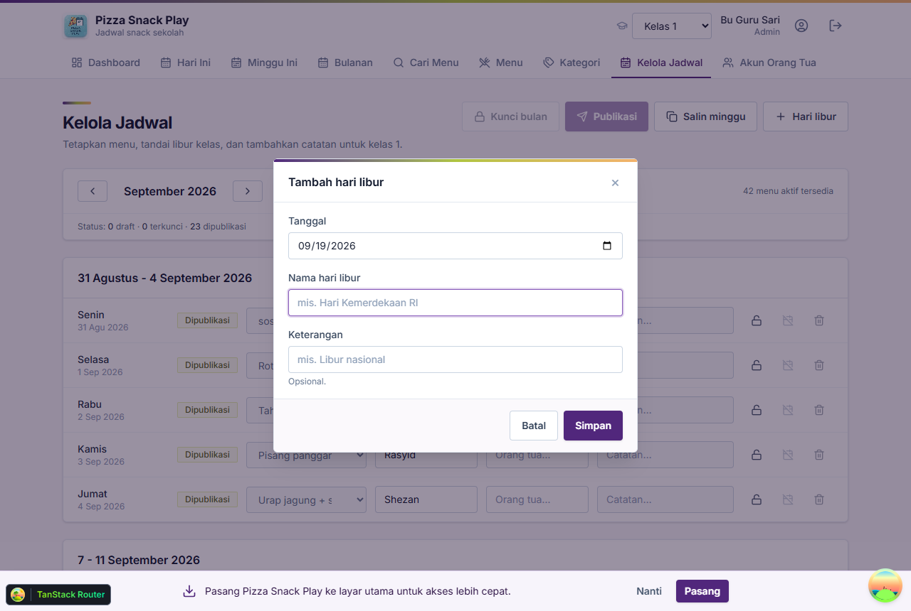

---

### UAT-11: Katalog Menu Snack

- **Tujuan**: Memverifikasi tampilan katalog menu snack sekolah yang dapat dipakai berulang.
- **Hasil**: Grid kartu menu menampilkan nama menu, deskripsi, chip komponen makanan utama & buah pendamping, tag kategori, serta tombol pencarian menu.
- **Screenshot**:
  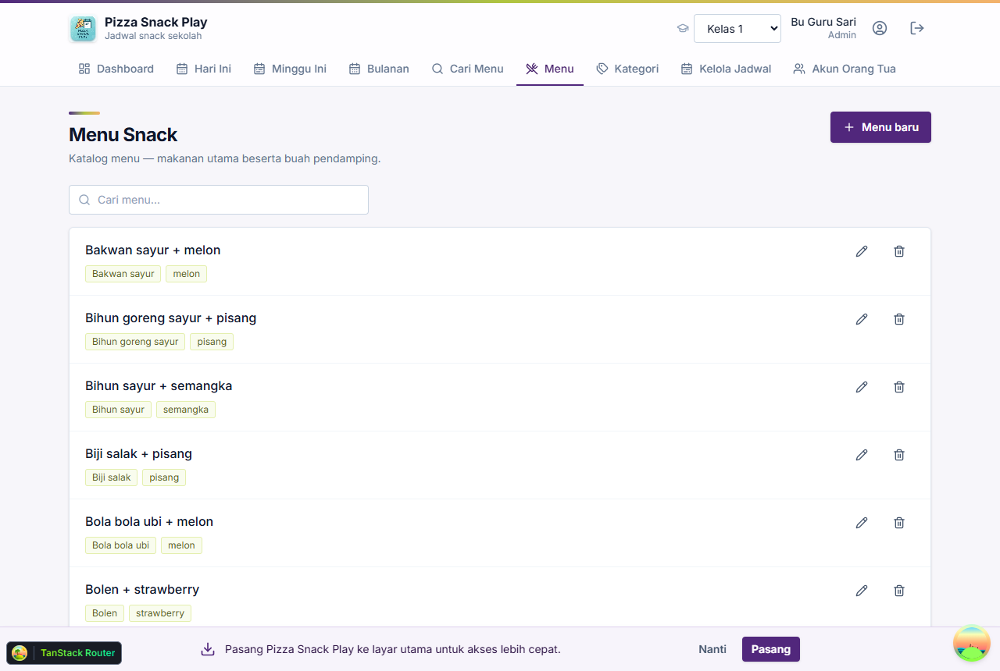

---

### UAT-12: Modal Dialog Tambah Menu Baru

- **Tujuan**: Memverifikasi form input pembuatan menu snack baru beserta komponennya.
- **Tindakan**: Menekan tombol `+ Menu baru`.
- **Hasil**: Modal formulir terbuka dengan input nama menu, deskripsi, penambahan baris komponen dinamis (jenis _Makanan Utama_ atau _Buah_), serta pemilihan kategori menu melalui checkbox.
- **Screenshot**:
  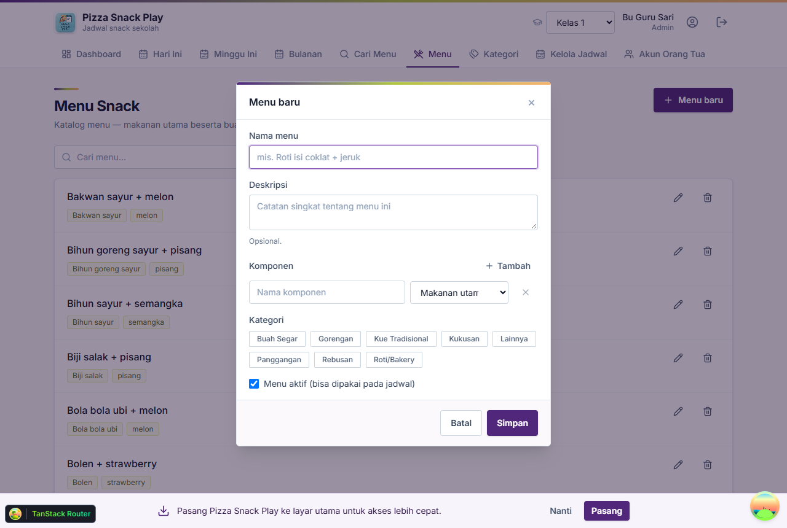

---

### UAT-13: Manajemen Kategori Menu

- **Tujuan**: Memverifikasi daftar kategori menu sekolah dan penetapan kode warna badge.
- **Hasil**: Menampilkan 8 kategori bawaan (misal: _rebusan, gorengan, manis, buah, gurih_) lengkap dengan slug, warna hex badge, dan jumlah menu yang terhubung.
- **Screenshot**:
  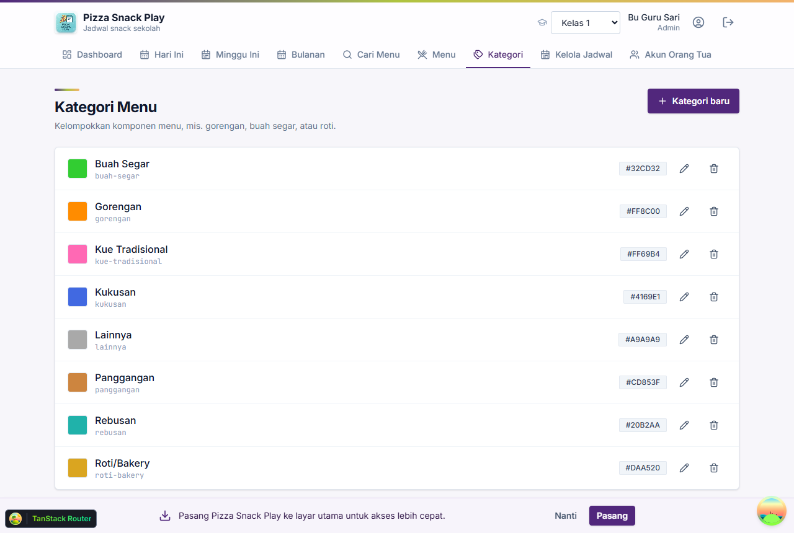

---

### UAT-14: Pencarian Riwayat Menu & Buah

- **Tujuan**: Memverifikasi fitur penelusuran riwayat menu lintas bulan dengan kata kunci dan rentang tanggal.
- **Tindakan**: Memasukkan kata kunci _"jeruk"_ pada halaman `/pencarian` dan menekan tombol _Cari_.
- **Hasil**: Sistem menampilkan 4 hari penyajian yang cocok di kelas 1, mengelompokkan hasil per bulan, dan memberikan penandaan teks tebal bersorot kuning (_highlight_) pada kata _"jeruk"_.
- **Screenshot**:
  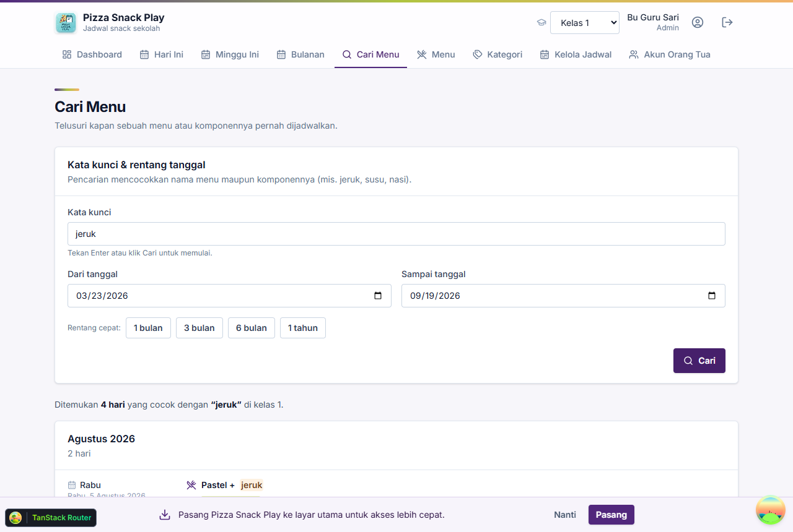

---

### UAT-15: Kelola Akun Orang Tua

- **Tujuan**: Memverifikasi tabel daftar akun wali murid, relasi siswa terdaftar, dan peran Korlas.
- **Hasil**: Tabel menampilkan kolom username, nama orang tua (beserta relasi _ibu/ayah_), nama anak & kelas, status aktif, serta lencana khusus `Korlas 1` untuk Pak Budi Santoso.
- **Screenshot**:
  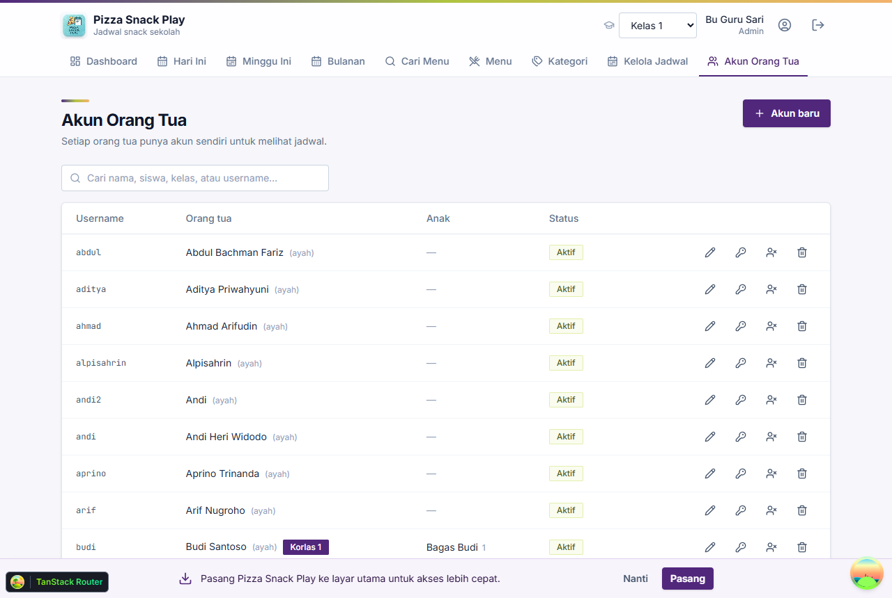

---

### UAT-16: Modal Dialog Tambah Akun Orang Tua

- **Tujuan**: Memverifikasi pendaftaran akun orang tua baru dengan dukungan multi-anak.
- **Tindakan**: Menekan tombol `+ Akun baru`.
- **Hasil**: Modal formulir menampilkan input username, password, nama orang tua, hubungan (_Ibu/Ayah/Wali_), pilihan peran (_Orang tua / Korlas_), nomor HP, email, dan daftar baris input anak dinamis (_Nama anak_ & _Kelas_).
- **Screenshot**:
  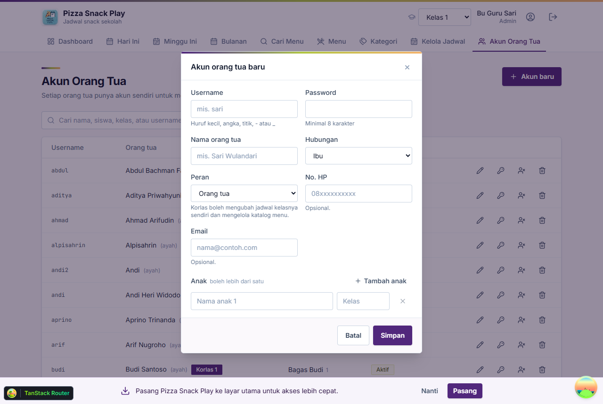

---

### UAT-17: Login Orang Tua & Fitur Pilih Jadwal (F9)

- **Tujuan**: Memverifikasi antarmuka orang tua murid (`sari`) dalam mengakses fitur perebutan slot tanggal piket yang belum ditetapkan.
- **Tindakan**: Login sebagai `sari` dan membuka rute `/pilih-jadwal`.
- **Hasil**: Halaman menampilkan tanggal-tanggal snack bulan September 2026. Tanggal yang sudah ditetapkan korlas ditandai _"Ditetapkan korlas"_, sedangkan tanggal kosong siap diklaim dengan satu klik tanpa dialog konfirmasi.
- **Screenshot**:
  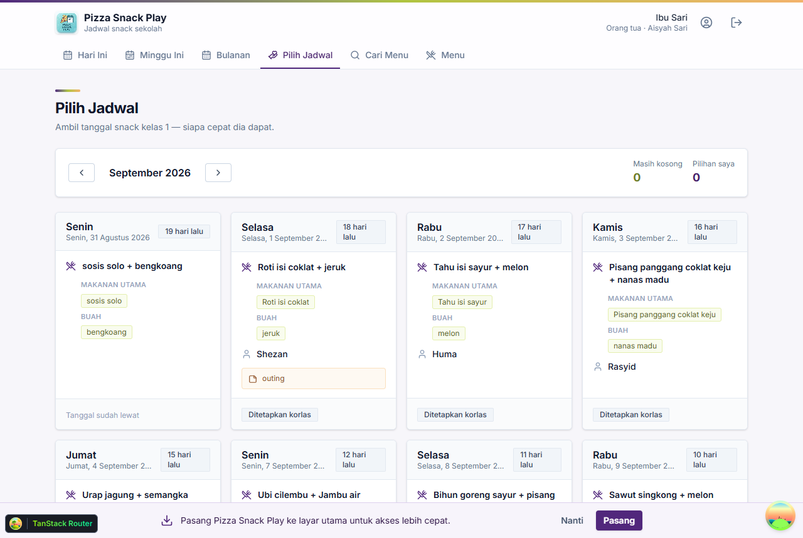

---

### UAT-18: Orang Tua Multi-Anak & Class Switcher

- **Tujuan**: Memverifikasi pengalaman pengguna orang tua dengan lebih dari satu anak di kelas berbeda.
- **Tindakan**: Login sebagai `dewi` (Ibu dari Citra Dewi di Kelas 2 dan Raka Dewi di Kelas 3).
- **Hasil**: Komponen _Class Switcher_ otomatis muncul di header samping nama pengguna. Header menampilkan `Ibu Dewi · Orang tua · 2 anak`, dan halaman _Hari Ini_ memuat kartu rincian kedua siswa.
- **Screenshot**:
  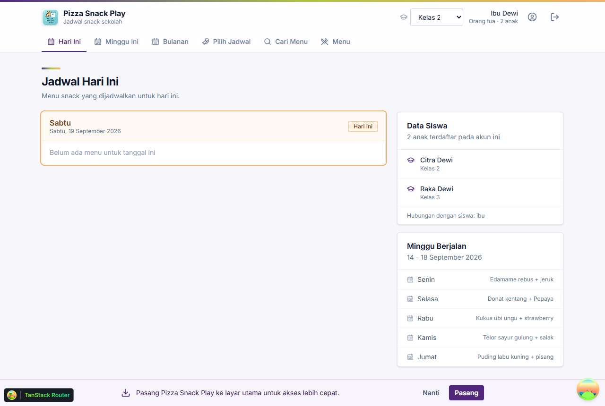

---

### UAT-19: Profil Pengguna Orang Tua & Form Ubah Password

- **Tujuan**: Memverifikasi halaman profil akun wali murid dan fasilitas penggantian kata sandi mandiri.
- **Hasil**: Menampilkan data akun pengguna, daftar siswa yang terdaftar, informasi hubungan wali, dan formulir perubahan password lengkap dengan validasi minimal 8 karakter.
- **Screenshot**:
  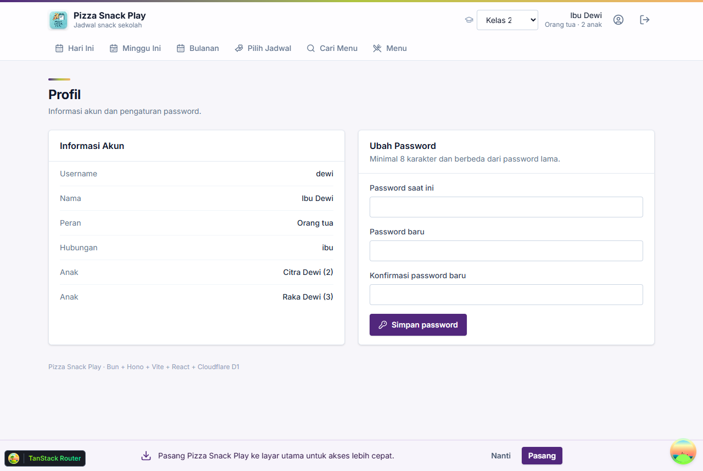

---

### UAT-20: Login Korlas (Wewenang Terbatas Khusus Kelas 1)

- **Tujuan**: Memverifikasi batasan navigasi dan wewenang operasional Koordinator Kelas.
- **Tindakan**: Login sebagai `budi` (Korlas Kelas 1).
- **Hasil**: Menu _Dashboard_ dan _Akun Orang Tua_ disembunyikan dari navigasi. Halaman _Kelola Jadwal_ terkunci secara eksplisit ke Kelas 1 (_"Tetapkan menu, tandai libur kelas, dan tambahkan catatan untuk kelas 1"_).
- **Screenshot**:
  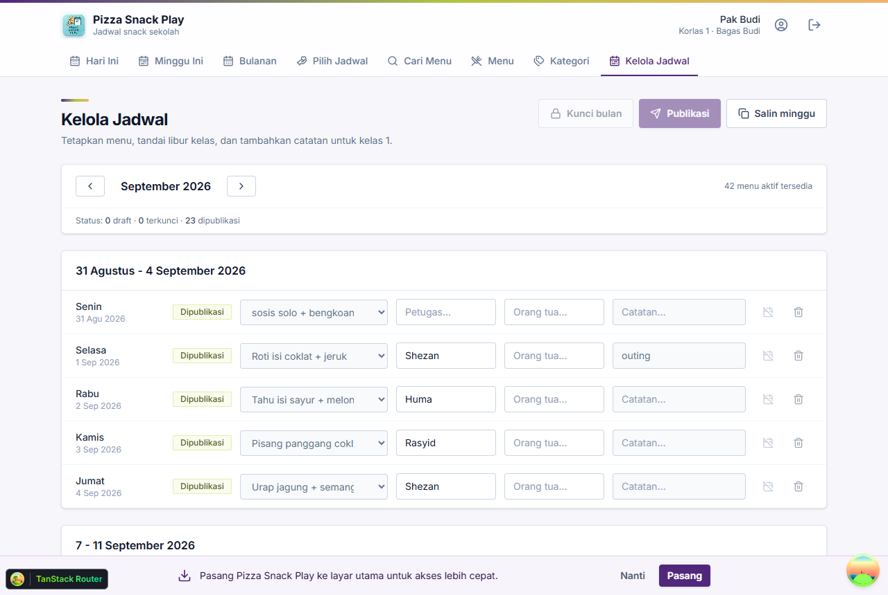

---

### UAT-21: Tampilan Mobile Viewport Smartphone & Banner PWA

- **Tujuan**: Memverifikasi responsivitas aplikasi pada layar smartphone dan kesiapan instalasi PWA.
- **Tindakan**: Mengatur viewport peramban ke resolusi smartphone 390x844 px (iPhone 12/13/14).
- **Hasil**: Navigasi horizontal dapat digeser secara mulus (_touch scrollable_), kartu jadwal menyesuaikan lebar layar, dan banner ajakan instalasi PWA (_"Pasang Pizza Snack Play ke layar utama untuk akses lebih cepat"_) muncul di bagian bawah layar.
- **Screenshot**:
  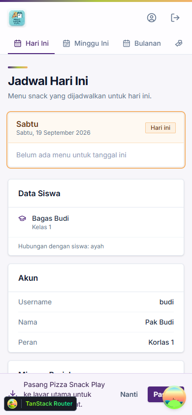

---

## 5. Kesimpulan & Rekomendasi

1. **Kelayakan Fungsional**: Seluruh 21 skenario UAT telah diuji secara otomatis dan dinyatakan **Lolos (100% Passed)**. Semua fitur utama (Autentikasi, RBAC, Jadwal Per Kelas, Kunci & Publikasi, Klaim Tanggal Piket, Pencarian Riwayat, Manajemen Akun Multi-Siswa, dan PWA) berjalan sesuai spesifikasi pada dokumen [PRD v1.7](PRD_Pizza_Snack_Play.md).
2. **Kualitas Tampilan UI/UX**: Sistem antarmuka bersih, konsisten menggunakan skala radius tegas (`rounded-lg` 4px, `rounded-2xl` 6px), palet warna tema teratur (_brand, accent, highlight_), dan responsif di berbagai resolusi layar.
3. **Rekomendasi Rilis**: Aplikasi **Pizza Snack Play** telah memenuhi seluruh kriteria penerimaan pengguna dan **siap untuk diterapkan ke tahap produksi** (_production deployment_).

---

## 6. Uji Regresi — Cakupan Sekolah-wide & Endpoint Status (20 September 2026)

Perubahan v1.9 (lihat [PRD v1.9](PRD_Pizza_Snack_Play.md)) tidak mengubah 21 skenario di atas,
tetapi menambah satu endpoint serta memecah UI. Regresi dijalankan terhadap dev server lokal:

| Suite                           | Hasil          | Catatan                                                                 |
| :------------------------------ | :------------- | :---------------------------------------------------------------------- |
| `bun run test:auth`             | **33 / 33**    | Tidak berubah                                                           |
| `bun run test:api`              | **224 / 224**  | Termasuk 38 assertion wewenang korlas & kunci/publikasi sekolah-wide     |
| `bun run test:status`           | **22 / 22**    | **Baru** — cakupan admin (seluruh kelas) vs korlas (kelas sendiri)       |
| `scripts/test-claim-cross-class.mjs` | **10 / 10** | Rebutan tanggal tetap per kelas                                         |

**Verifikasi cakupan sekolah-wide.** `GET /schedules/status` tanpa `?class=` oleh admin
mengembalikan **seluruh** kelas (`classes` = 1–6) dengan rincian `perClass` masing-masing;
korlas `budi` hanya menerima kelas `1`. Angka `totals` diverifikasi sama dengan penjumlahan
`perClass`, dan `canPublish` mengikuti aturan `draftCount === 0 && lockedCount > 0`.

**Dua cacat yang ditemukan & diperbaiki saat pengujian:**

1. `resolveReadClass` mengembalikan **kelas pertama** (bukan `null`) saat admin mengosongkan
   `?class=`. Endpoint status sempat ikut terpersempit ke kelas 1 — persis gejala "tidak
   kesemua kelas". Handler kini menetapkan cakupan admin secara eksplisit sebelum memanggil
   `resolveReadClass`.
2. Assertion `dayOfWeek cocok dengan nama hari` di `test:api` gagal setiap **hari Minggu**:
   `dayOfWeek` menormalkan Minggu ke `7`, sedangkan pengujian hanya menangani `6` dan `0`.
   Pengujian diperbaiki.

---

_Laporan ini dihasilkan secara otomatis oleh UAT Test Runner `scripts/run-uat.mjs`._
